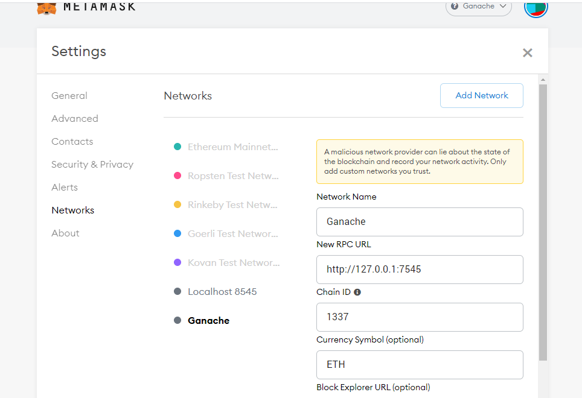
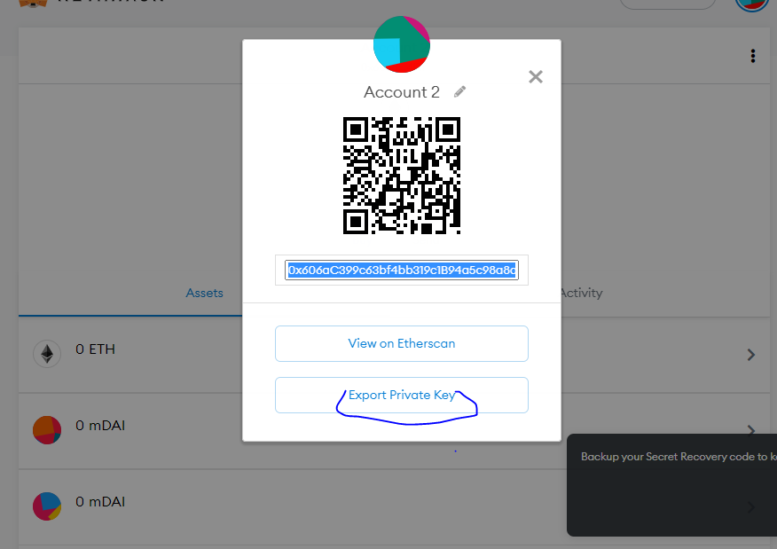
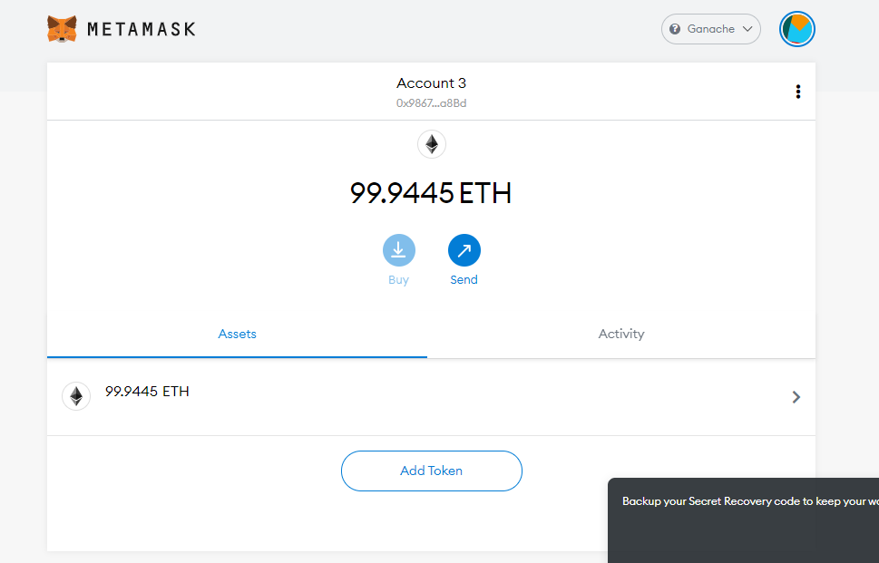
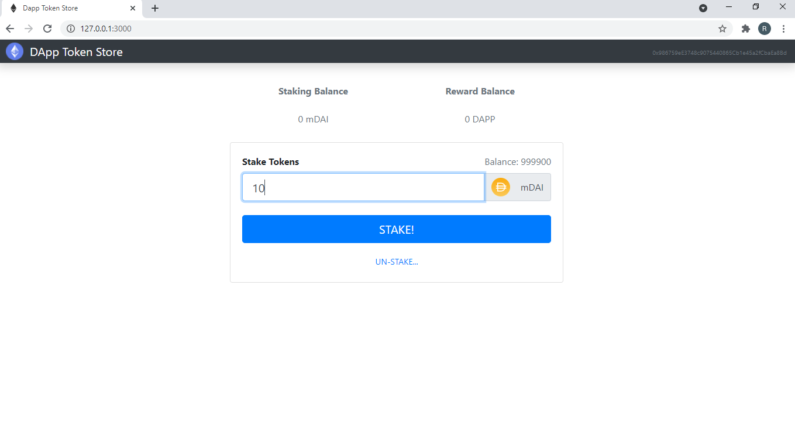
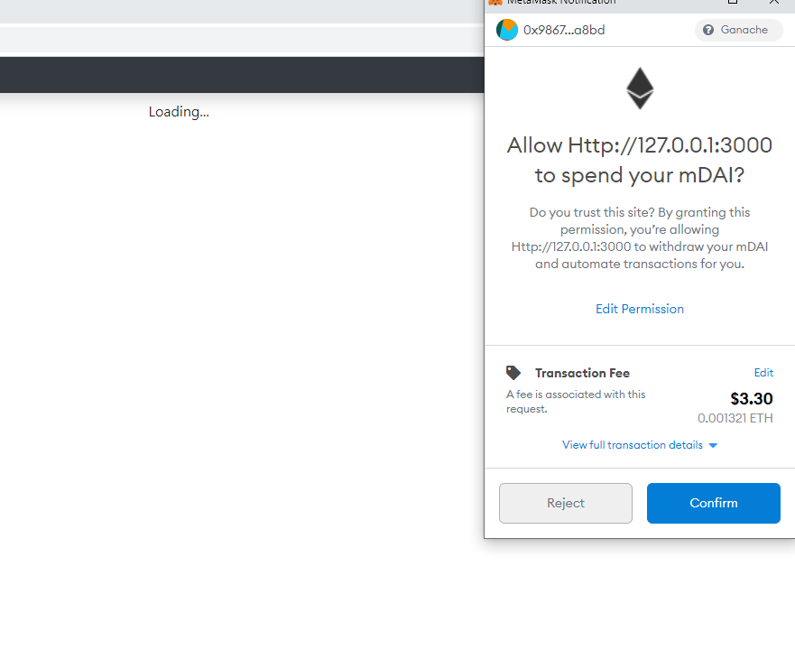
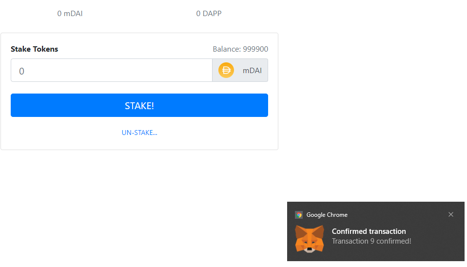

Dependencies

nodejs -node.js® is a JavaScript runtime built on Chrome's V8 JavaScript engine.
link : https://nodejs.org/en/

Ganache - A on click blockchain ,allows to spin up a blockchain on our computer
link : https://www.trufflesuite.com/ganache

metamask extention: Etherium wallet,has the capability to turn a regular web browser to a blockchain web browser
link(chrome): https://chrome.google.com/webstore/detail/metamask/nkbihfbeogaeaoehlefnkodbefgpgknn?hl=en

Installation of truffle on windows machine 

1.```npm install -g truffle```
2.```npm install -g npm```
3.```npm install -g ethereumjs-testrpcnpm```
4.```install -g -production windows-build-tools```

To start the project on localhost
1.```truffle compile```
2.```truffle migrate```
3.```npm install```
4.```npm start```

Make sure Netmask and  Ganache are up and running
truffle migrate should remove some coin from the 100 value.

click the key symbol for private key

This are the default setting for netmask


Export Private key of ganache to netmask


after a successfull connection you will get this output


stack 10 coins


confirmation pop-up


confirm


if the connection between ganache or netmask are't successfull you may a get a loading screen


